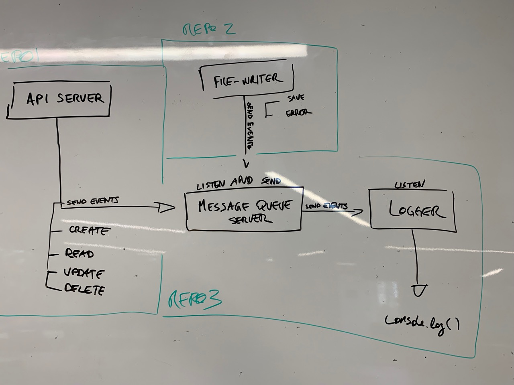

# LAB - 19

## Socket.io - File Writer

### Author: Joé Jemmely

### Links and Resources

- [submission PR](https://github.com/401-advanced-javascript-joejemmely/lab-19-file-writer/pull/1)
- [travis](https://github.com/401-advanced-javascript-joejemmely/lab-19-file-writer)

#### Documentation

## alterFile(file)

Async function to read, transform, and write

**Kind**: global function

| Param | Type            |
| ----- | --------------- |
| file  | <code>\*</code> |

## events

files

| Param | Description |
| ----- | ----------- |
| SAVE  |             |
| ERROR |             |

database

| Param  | Description |
| ------ | ----------- |
| CREATE |             |
| READ   |             |
| UPDATE |             |
| DELETE |             |

### Setup

#### Running the app

- `npm start <filename.ext>`

#### Tests

- No test yet

#### UML

